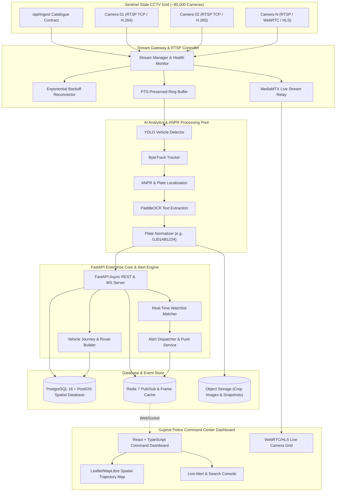

# Gujarat Police Sentinel — Unified CCTV Intelligence Architecture

## 1. High-Level Architecture Diagram

---

## 2. Database Schema Overview (PostgreSQL + PostGIS)

- `users`: User authentication, credentials (Argon2), role (`POLICE_OFFICER`, `COMMANDER`, `ADMIN`).
- `departments`: Department metadata (Home Dept, RTO, PDS, Municipal Corporations).
- `cameras`: Camera ID, department_id, name, latitude, longitude, stream_type, codec (`H264`/`H265`), status (`ONLINE`/`OFFLINE`), last_seen, metadata JSON.
- `camera_health`: Ping latency, reconnect count, frame drop rates, PTS status logs.
- `vehicles`: Distinct normalized license plate records (`GJ01AB1234`), first_seen, last_seen, total_detections, flag_status.
- `detections`: Unique detection event ID, camera_id, timestamp (PTS), vehicle_class, track_id, plate_number, plate_confidence, detection_confidence, bounding_box [x1,y1,x2,y2], crop_path, location (`GEOMETRY(Point, 4326)`).
- `watchlist`: Plate number, category (`STOLEN`, `WANTED`, `SUSPICIOUS`), priority (`CRITICAL`, `HIGH`, `MEDIUM`), added_by, notes, active status.
- `alerts`: Alert ID, detection_id, watchlist_id, timestamp, camera_id, location, status (`NEW`, `ACKNOWLEDGED`, `DISPATCHED`, `RESOLVED`), notes.

---

## 3. Scale-Out Architecture Strategy (~80,000 Cameras)

1. **Edge AI & Regional Gateways**:
   - Camera clusters grouped by District Police Headquarters (e.g. Ahmedabad, Surat, Vadodara, Rajkot, Border Districts).
   - Local stream gateways perform decoding and lightweight YOLO detection at regional edge nodes.
2. **Kafka/RabbitMQ Event Backbone**:
   - Detections and ANPR events published to a distributed Kafka bus.
   - Central control plane consumes events asynchronously for database persistence and instant watchlist matching.
3. **Database Partitioning**:
   - PostgreSQL `detections` table partitioned horizontally by range on `timestamp` (daily/monthly partitions).
   - Spatial indexing via `GIST` on PostGIS point geometry for instant radius and geospatial searches.
4. **Storage Tiering**:
   - Hot tier: Redis in-memory cache for live active tracks and last 1-hour detections.
   - Warm tier: Local NVMe / MinIO Object Storage for bounding box crops and plate crops (30-day retention).
   - Cold tier: S3 Glacier archive for full historical detection metadata.
